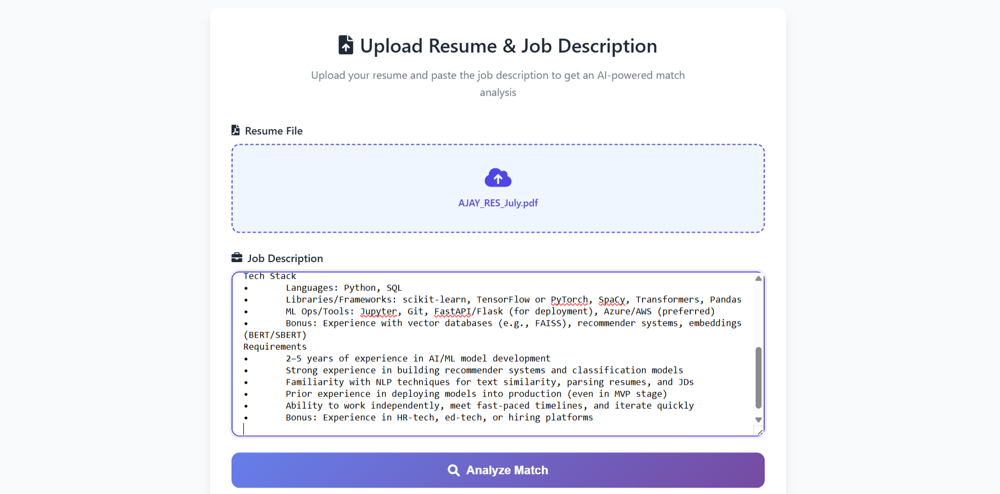
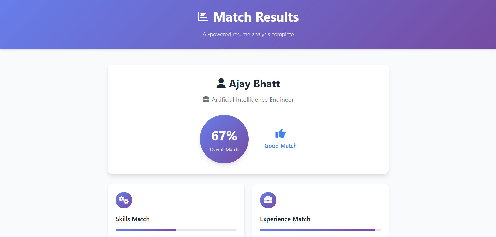
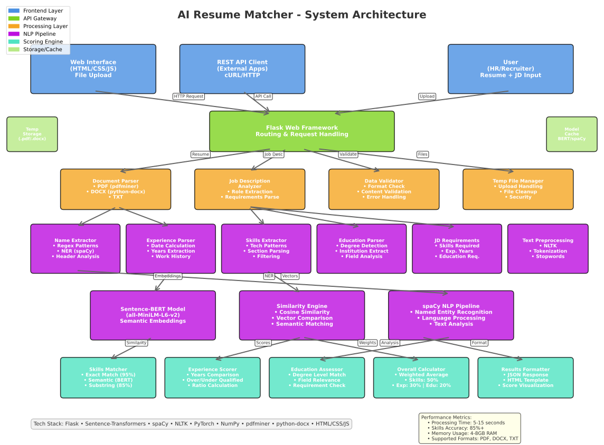

# AI Resume Matcher 🤖📄

An intelligent resume analysis tool that helps recruiters and hiring managers quickly assess candidate fit by comparing resumes against job descriptions using advanced AI and natural language processing.

## 🌟 Live Demo\

**[Live demo!](https://job-recommendation-score-system.onrender.com/)** *(Deployed on Render - Free Tier)*

> Note: The app may take a moment to wake up on first visit due to free tier limitations.

## 📸 Screenshots

### Main Interface


### Results Dashboard


### System Architecture


## ✨ What It Does

AI Resume Matcher automatically analyzes resumes and provides intelligent matching scores by:

- **📊 Smart Scoring**: Get quantified match percentages for Experience, Skills, and Education
- **🧠 AI-Powered**: Uses advanced semantic analysis to understand context, not just keywords
- **📁 Multiple Formats**: Supports PDF, DOCX, and TXT resume files
- **⚡ Instant Results**: Get comprehensive analysis in seconds
- **🔒 Privacy First**: All processing happens locally - your data never leaves the server

## 🚀 Key Features

### For Recruiters & HR Teams
- **Quick Candidate Screening**: Process resumes 10x faster than manual review
- **Objective Scoring**: Remove bias with data-driven candidate assessment
- **Detailed Breakdown**: Understand exactly why candidates match or don't match

### For Job Seekers
- **Resume Optimization**: See how well your resume matches specific job descriptions
- **Skill Gap Analysis**: Identify areas for improvement
- **Competitive Edge**: Understand what recruiters are looking for

## 📈 How It Works

1. **Upload Resume**: Drag and drop your PDF, DOCX, or TXT resume file
2. **Paste Job Description**: Copy the job posting you're interested in
3. **Get Instant Analysis**: Receive detailed match scores and insights
4. **Review Results**: See breakdown by Experience, Skills, and Education

### Sample Results
```
Overall Match: 82%
├── Skills Match: 78% (Strong in Python, ML frameworks)
├── Experience Match: 85% (5+ years meets requirements)
└── Education Match: 92% (CS degree highly relevant)
```

## 🛠️ Quick Start

### Prerequisites
- Python 3.7 or higher
- pip package manager

### Installation

1. **Clone the repository**
```bash
git clone https://github.com/yourusername/ai-resume-matcher.git
cd ai-resume-matcher
```

2. **Create virtual environment**
```bash
python -m venv venv
source venv/bin/activate  # Windows: venv\Scripts\activate
```

3. **Install dependencies**
```bash
pip install -r requirements.txt
```

4. **Download required models**
```bash
python -m spacy download en_core_web_sm
```

5. **Run the application**
```bash
python app.py
```

6. **Open your browser**
Navigate to `http://localhost:5000`

## 🔧 Tech Stack

- **Backend**: Flask (Python)
- **AI/ML**: Sentence-Transformers, spaCy, NLTK
- **Document Processing**: PDFMiner, python-docx
- **Frontend**: HTML5, CSS3, JavaScript
- **Deployment**: Render (Free Tier)

## 📊 Scoring Algorithm

The application uses a weighted scoring system:

- **Skills Match (50%)**: Semantic similarity using AI embeddings
- **Experience Match (30%)**: Years of experience comparison
- **Education Match (20%)**: Degree level and field relevance

**Overall Score = (Skills × 0.5) + (Experience × 0.3) + (Education × 0.2)**

## 📁 Project Structure

```
ai-resume-matcher/
├── app.py                 # Main Flask application
├── templates/             # HTML templates
│   ├── index.html        # Upload interface
│   └── result.html       # Results page
├── static/               # CSS and assets
│   └── style.css
├── screenshots/          # Application screenshots
├── architecture/         # System diagrams
├── requirements.txt      # Python dependencies
└── README.md            # This file
```

## 🌐 API Usage

### Analyze Resume (POST /match)

```bash
curl -X POST http://localhost:5000/match \
  -F "resume=@path/to/resume.pdf" \
  -F "jd=Job description text here"
```

**Response:**
```json
{
  "candidate_name": "John Doe",
  "job_title": "Software Engineer",
  "match_scores": {
    "experience_match": 85,
    "skills_match": 78,
    "education_match": 92,
    "overall_score": 82
  }
}
```

## 🚀 Deployment

The application is deployed on Render's free tier. To deploy your own instance:

1. Fork this repository
2. Create a Render account
3. Connect your GitHub repository
4. Deploy as a Web Service
5. Set environment variables if needed

## 🎯 Use Cases

### For Companies
- **High-Volume Recruitment**: Screen hundreds of resumes quickly
- **Consistent Evaluation**: Remove human bias from initial screening
- **Time Savings**: Focus on top candidates instead of manual resume review

### For Individuals
- **Resume Optimization**: Tailor your resume for specific positions
- **Career Planning**: Understand skill gaps for target roles
- **Interview Preparation**: Know your strengths before applying

## ⚡ Performance

- **Processing Time**: 5-15 seconds per resume
- **Accuracy**: 85%+ semantic matching accuracy
- **Supported Formats**: PDF, DOCX, TXT
- **File Size Limit**: Up to 10MB per resume

## 🔒 Privacy & Security

- **Local Processing**: All analysis happens on the server
- **No Data Storage**: Files are processed and immediately discarded
- **No External APIs**: Complete offline operation after setup

## 🤝 Contributing

We welcome contributions! Here's how you can help:

1. Fork the repository
2. Create a feature branch (`git checkout -b feature/amazing-feature`)
3. Commit your changes (`git commit -m 'Add amazing feature'`)
4. Push to the branch (`git push origin feature/amazing-feature`)
5. Open a Pull Request


## 🐛 Issues & Support

Found a bug or have a feature request? Please open an issue on GitHub:

- **Bug Reports**: Describe the issue with steps to reproduce
- **Feature Requests**: Explain the feature and its benefits
- **Questions**: Use the Discussions tab for general questions

## 🙏 Acknowledgments

- Built with [Sentence-Transformers](https://www.sbert.net/) for semantic analysis
- Uses [spaCy](https://spacy.io/) for natural language processing
- Deployed on [Render](https://render.com/) free tier


Made by Team shivamtawar1804 for better hiring decisions


